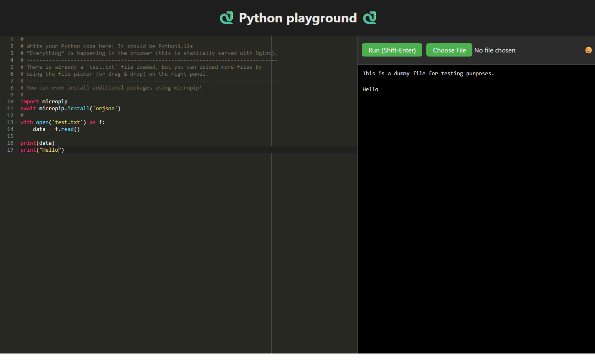

# Python playground in the browser



This shows that you can run a Python interpreter in the browser using [Pyodide](https://pyodide.org/en/stable/).  
In one sentence, Pyodide is a Python distribution for the browser (and Node.js), based on WebAssembly.  
Here it is paired with the [Ace](https://ace.c9.io/) code editor, which is a lightweight, embeddable code editor written in JavaScript.

You can leverage *micropip* to install dependencies.  
For the dependencies that are pure-Python, the wheels are fetched from PyPI, and for the other ones, thankfully, the Pyodide team has already built [WASM wheels](https://pyodide.org/en/stable/usage/packages-in-pyodide.html) for them.

In this UI you can upload files, it will use `pyodide.FS.writeFile(...)`, which writes those files to the virtual filesystem of Pyodide.  
Note that any code written in the editor will be saved to the browser local storage, so you can come back later and continue working on it.

To run it, you just need to static serve the files in this directory.

```bash
python3 -m http.server
```

In a production setting, I recommend to serve this with Nginx or something.  
This repository is deployed using GitHub Pages [here](https://alexprengere.github.io/python_playground/). Try it out!
